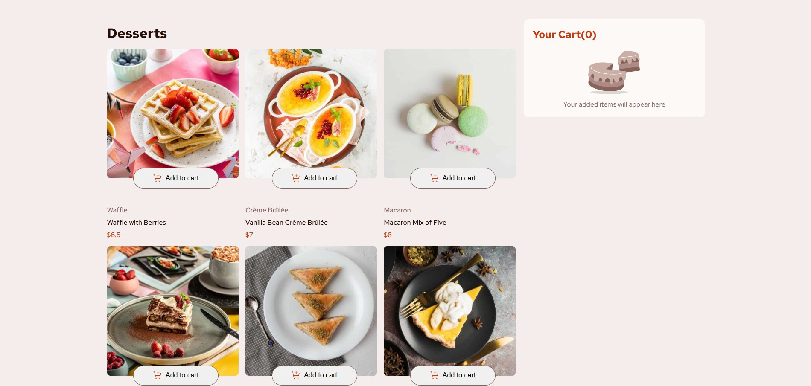
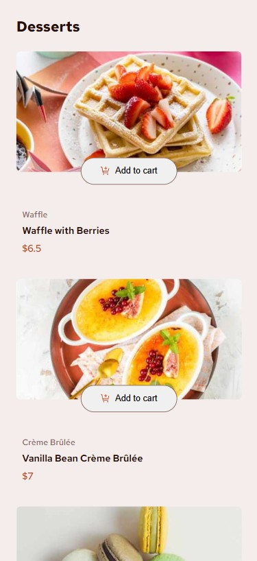

# Product List with Cart - Frontend Challenge

This is a solution to the Product list with cart challenge. This project demonstrates a fully functional e-commerce product listing page with shopping cart functionality, built with React and TypeScript.

## Table of contents

- [Overview](#overview)
  - [The challenge](#the-challenge)
  - [Screenshot](#screenshot)
  - [Links](#links)
- [My process](#my-process)
  - [Built with](#built-with)
  - [What I learned](#what-i-learned)
  - [Continued development](#continued-development)
  - [Useful resources](#useful-resources)

## Overview

### The challenge

Users should be able to:

- ✅ Add items to the cart and remove them
- ✅ Increase/decrease the number of items in the cart
- ✅ See an order confirmation modal when they click "Confirm Order"
- ✅ Reset their selections when they click "Start New Order"
- ✅ View the optimal layout for the interface depending on their device's screen size
- ✅ See hover and focus states for all interactive elements on the page

### Screenshot




### Links

- Live Site URL: [Product List with Cart](https://your-live-site-url.com)

## My process

### Built with

- [React](https://reactjs.org/) - JS library
- [TypeScript](https://www.typescriptlang.org/) - For type safety
- [Vite](https://vitejs.dev/) - Build tool
- CSS custom properties
- Flexbox
- CSS Grid
- Mobile-first workflow
- Component-based architecture

### What I learned

This project was an excellent opportunity to practice several key React concepts:

**Component Creation and Composition**

I created multiple reusable components like ProductItem, ButtonCount, Cart, and ModalConfirm that work together to form a complete application.

```tsx
const ButtonCount = ({onChangeQuantity, onReset, isReset, currentQuantity}: ButtonCountProps) => {
  const [isInCart, setIsInCart] = useState<boolean>(false);
  const [count, setCount] = useState<number>(0);
  
  // Component logic here
}
```

**Props and TypeScript Interface Definition**

I learned how to properly define and use TypeScript interfaces for component props and data structures:

```tsx
type ButtonCountProps = {
  onChangeQuantity: (value: number) => void;
  currentQuantity: number;
  onReset: boolean;
  isReset: boolean;
}
```

**State Lifting**

I implemented state lifting to manage shared state across components, particularly for the shopping cart functionality:

```tsx
const handleAddToCart = (product: Product, quantity: number) => {
  const productWithQuantity = { ...product, quantity };
  
  // Logic for adding products to cart
  
  setProductsInCart((currentProducts) => [
    ...currentProducts,
    productWithQuantity,
  ]);
}
```

**React Effects for Side Effects**

I used useEffect to manage side effects like resetting the cart state:

```tsx
useEffect(() => {
  if (isReset) {
    // Reset component state
    setCount(0);
    setIsInCart(false);
    // Additional reset logic
  }
}, [isReset, onChangeQuantity]);
```

**Responsive Design**

I implemented responsive design using CSS media queries to ensure the application works well on both desktop and mobile devices:

```css
@media screen and (max-width: 768px) {
  .product-list-container .product-list-container__list {
    grid-template-columns: repeat(1, 1fr);
    gap: 30px;
  }
}
```

### Continued development

In future projects, I would like to focus on:

- Implementing state management solutions like Redux or Context API for more complex applications
- Adding animations for better user experience
- Enhancing accessibility features
- Implementing unit tests with React Testing Library

### Useful resources

- [React Documentation](https://react.dev/) - The official React documentation helped me understand hooks and component lifecycle.
- [TypeScript Handbook](https://www.typescriptlang.org/docs/handbook/intro.html) - Essential resource for learning TypeScript with React.
- [CSS Grid Guide](https://css-tricks.com/snippets/css/complete-guide-grid/) - This helped me implement the responsive grid layout for the product listings.
